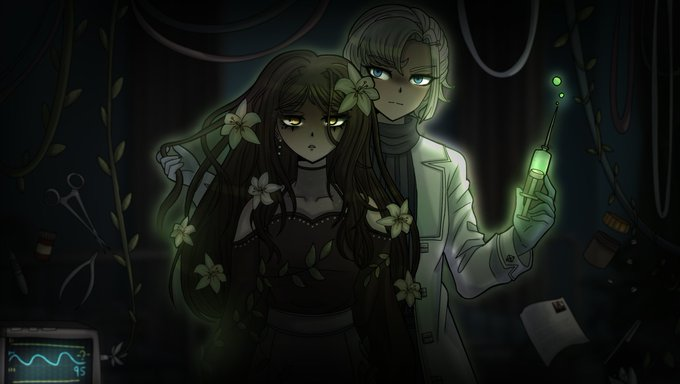

## Hi there!

My name is Gianmaria Romano, and I am a third-year undergraduate student at **Sapienza Università di Roma**, currently pursuing a Bachelor's Degree in *Applied Computer Science and Artificial Intelligence*.

---

## 📍 About Me

📚 **Research interests:**

- Computer Vision 📸
- Data Analysis 📈
- Machine Learning 🤖
- Neural Networks 🧠
- Reinforcement Learning 🧿

💻 **Programming languages:**

- Python 🐍
- Java ☕
- LaTeX 🟰
- R 📻
- C 💾

---

## 🌊

> *「朝のリレー」*  
>  
> カムチャッカの若者が  
> きりんの夢を見ているとき  
> メキシコの娘は  
> 朝もやの中でバスを待っている  
> ニューヨークの少女が  
> ほほえみながら寝がえりをうつとき  
> ローマの少年は  
> 柱頭を染める朝陽にウインクする  
> この地球では  
> いつもどこかで朝がはじまっている  
>  
> ぼくらは朝をリレーするのだ  
> 経度から経度へと  
> そうしていわば交替で地球を守る  
> 眠る前のひととき耳をすますと  
> どこか遠くで目覚まし時計のベルが鳴ってる  
> それはあなたの送った朝を  
> 誰かがしっかりと受けとめた証拠なのだ  
>  
> — ⾕川俊太郎

---

## 💮

> *I wonder sometimes... If dried flowers like being forced to last like that?*

  

---

## 🎼

  

  <em>私は自分より程度が低いと思う者を支配できる力があります</em>

---
